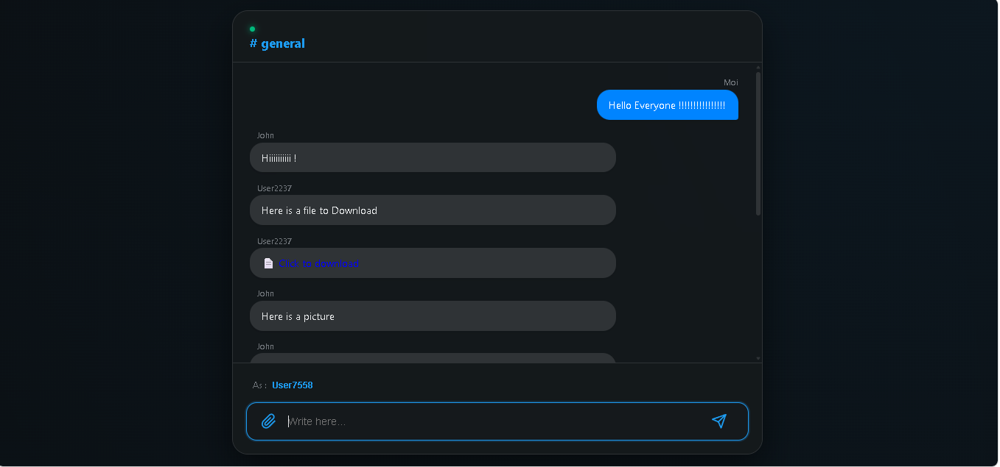
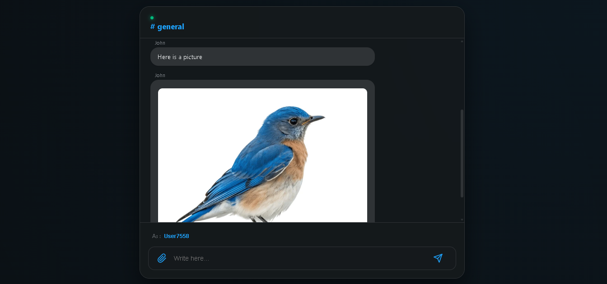
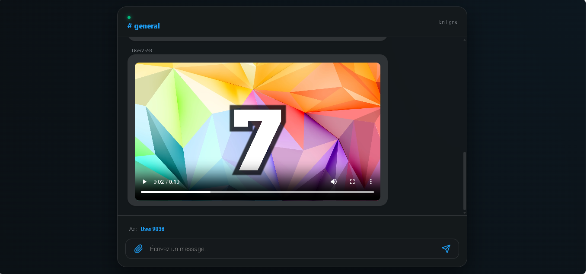

# RoomTalk : Real-Time WebSocket Chat
# RoomTalk 🎙️

Multi-room real-time chat, no account required.

---

## Screenshots




---

## Stack

| Layer | Technology |
|-------|------------|
| Backend | Django 5 + Django Channels |
| WebSocket | Daphne (ASGI) |
| Channel layer | Redis |
| Database | MongoDB (motor async) |
| Frontend | HTML / JS vanilla |

---

## Features

- Join a room by URL — /chat/name
- Real-time messages via WebSocket
- Send photos, videos and files
- Message history persisted in MongoDB

---

## Installation

- Specify redis url in settings.py

```bash
# Dependencies
pip install requirements.txt
python manage.py runserver
```


## 👤 Author

**Souhail HMAHMA** — Python Developer

🌐 [souhail3.vercel.app](https://souhail3.vercel.app) · 💼 [LinkedIn](https://linkedin.com/in/souhail-hmahma) · 🐙 [GitHub](https://github.com/souhmahma)
